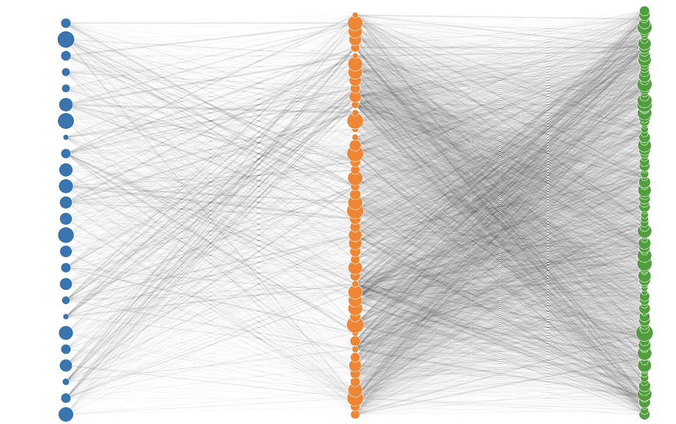
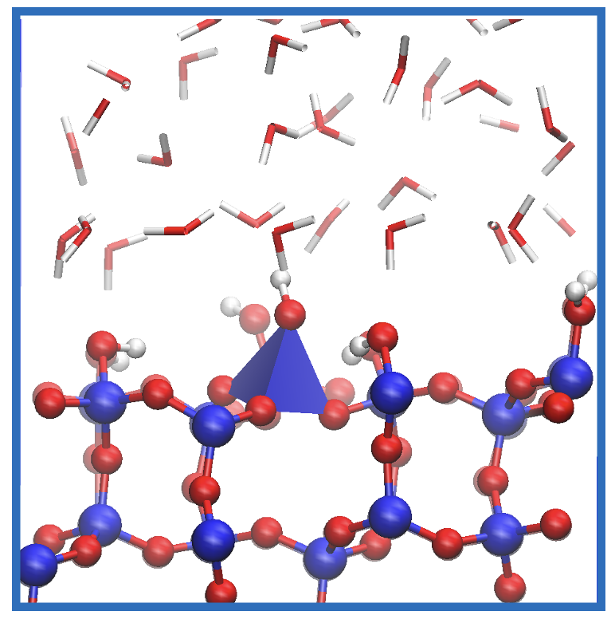
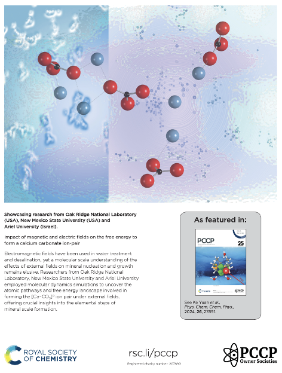
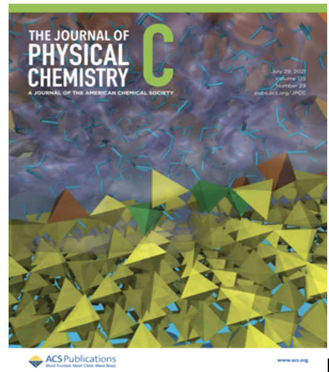
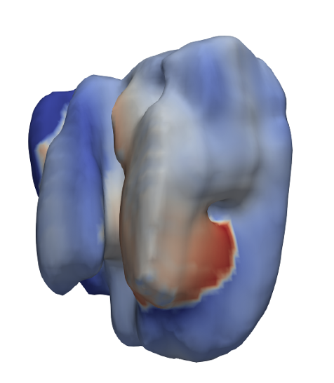
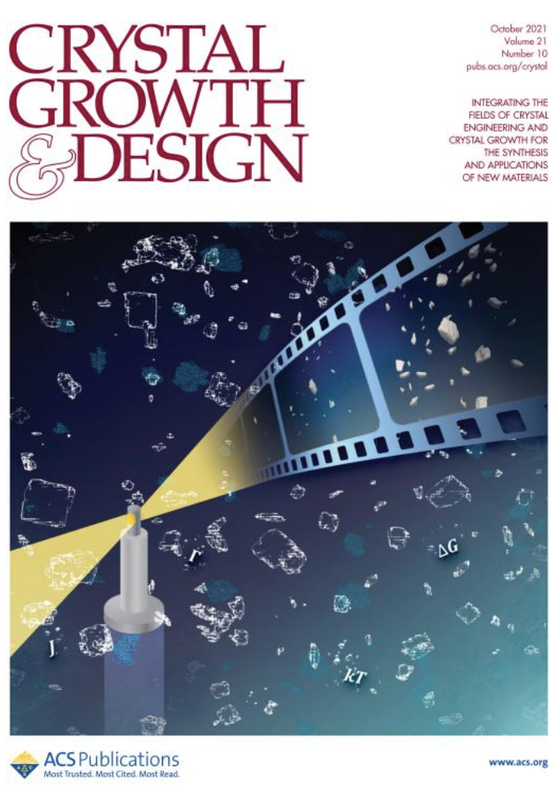
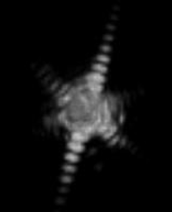

<h2 style="margin-top:20px; color:#267CB9;">
Welcome to the Interfacial Earth Materials Lab website.
</h2>

<h2 class="section-header" id="research">
Research   
</h2>

Reactions occurring at mineral–water interfaces influence a wide range of geochemical processes, including weathering, metal cycling, and the properties of Earth materials. These reactions are often initiated at non-ideal surface sites that are highly reactive and exhibit rapid structural dynamics. I am interested in understanding the fundamental reaction mechanisms at mineral–water interfaces using molecular-scale simulations, complemented by laboratory experiments and close collaborations with faculty members from the [Department of Geosciences](https://www.stonybrook.edu/geosciences/) at Stony Brook, to reveal how minerals respond to complex (bio)geochemical environments. Current research topics include:

1.	Mineral dissolution–reprecipitation and redox reactions relevant to critical mineral extraction
2.	Molecular simulations of the uptake and release of emerging contaminants in groundwater aquifers
3.	Atomistic modeling of material properties and interfacial processes under extreme conditions

Please feel free to contact me to learn more about research opportunities or potential collaborations.

<h2 class="section-header" id="team-members">
Team Members  
</h2>

### Ke Yuan
Assistant Professor 
Department of Geosciences 
Stony Brook University 
Email: ke.yuan@stonybrook.edu

 

### Education
-    Ph.D. University of Michigan, Ann Arbor, 2015
-	M.S. China University of Geosciences, Beijing, 2011
-	B.S. China University of Geosciences, Beijing, 2009

### Work experience
-	Research Associate, [Oak Ridge National Laboratory](https://www.ornl.gov) 2020-2026
-	Postdoctoral Researcher, [Oak Ridge National Laboratory](https://www.ornl.gov) 2019-2020
-	Postdoctoral Researcher, [Argonne National Laboratory](https://www.anl.gov) 2015-2019

<h2 class="section-header" id="join-us">
Join Us  
</h2>

The Interfacial Earth Materials Lab is seeking one postdoctoral researcher and 1–2 Ph.D. students to join our research team. The postdoctoral position is expected to begin as early as Fall 2026, while prospective Ph.D. students are expected to start in Summer or Fall 2027. We also welcome motivated undergraduate students who are interested in gaining research experience in our lab.
 

We welcome applicants with backgrounds in geochemistry, physical chemistry, machine learning, materials science, environmental science, or closely related disciplines. Individuals with interests and experience in molecular simulations, surface chemistry, electrochemistry, critical minerals, redox reactions, or related areas are especially encouraged to apply. Please email me your CV along with a brief statement describing your research background and academic or career goals.

<h2 class="section-header" id="facilities">
Facilities 
</h2>

We have access to advanced high‑performance computing (HPC) clusters at SBU.
- [SeaWulf & NVwulf](https://rci.stonybrook.edu/HPC)

We collaborate with researchers at the nearby Brookhaven National Laboratory (BNL) and utilize its world-class user facilities, including the Center for Functional Nanomaterials (CFN) and the National Synchrotron Light Source II (NSLS-II).
- [BNL-CFN](https://www.bnl.gov/cfn/)
- [BNL-NSLS-II](https://www.bnl.gov/nsls2/)

<h2 class="section-header" id="teaching">
Teaching
</h2>

Fall 2026, Graduate Research Seminar (Surface and Interfacial Geochemistry)

<a href="#navigation">⬆ Back to Navigation</a>

<h2 class="section-header" id="publications">
Publications
</h2>

Please see the complete publication list at [Google scholar](https://scholar.google.com/citations?user=FhJGYIQAAAAJ&hl=en) and [ORCID](https://orcid.org/0000-0003-0565-0929)
(The publications listed below were published prior to joining Stony Brook University.)
 

### Ion sorption, proton transfer, and surface structure
K. Yuan, N. Rampal, S. Adapa, B.R. Evans, J.N. Bracco, M.G. Boebinger, A.G. Stack, J. Weber (2024) [Iron Impurity Impairs the CO2 Capture Performance of MgO: Insights from Microscopy and Machine Learning Molecular Dynamics](https://doi.org/10.1021/acsami.4c13597) ACS Applied Materials & Interfaces, 16 (46), 64233-64243. 

  

K. Yuan, N. Rampal, S. Irle, L.J. Criscenti, S.S. Lee, S. Adapa, A.G. Stack (2024) [Variations in Proton Transfer Pathways and Energetics on Pristine and Defect-rich Quartz Surfaces in Water: Insights into the Bimodal Acidities of Quartz](https://www.sciencedirect.com/science/article/abs/pii/S0021979724006465?via%3Dihub) Journal of Colloid and Interface Science, 666, 232-243. 

  

P. Yang, K. Yuan, R. Khanal, S. Irle, L. M. Anovitz, P. Fenter, A.G. Stack, S.S. Lee (2024) [Variation in Cation Adsorption Mechanism Controlled by Chemical and Structural Heterogeneities at the Quartz (101)–Water Interface](https://doi.org/10.1021/acs.jpcc.4c03910) The Journal of Physical Chemistry C, 128 (41), 17372-17386.

K. Yuan, N. Rampal, X. Du, F. Shu, Y. Wang, H. Wang, A.G. Stack, P.B. Ishai, L.M. Anovitz, P. Xu (2024) [Impact of Magnetic and Electric Fields on the Free Energy to form a Calcium Carbonate ion-pair](https://doi.org/10.1039/D4CP02041C)
 Physical Chemistry Chemical Physics, 26 (44), 27891-27901.

  

K. Yuan, N. Rampal, P. Fenter, J.D. Kubicki, A.G. Stack, S. Irle (2021) [Density Functional Tight-Binding Simulations Reveal the Presence of Surface Defects on the Quartz (101)–Water Interface](https://doi.org/10.1021/acs.jpcc.1c03689) The Journal of Physical Chemistry C 125 (29), 16246-16255. 

  

 
S.L. Estes, Y. Arai, U. Becker, S. Fernando, K. Yuan, R.C. Ewing, J.M. Zhang, T. Shibata, B.A. Powell (2013) [A self-consistent model describing the thermodynamics of Eu(III) adsorption onto hematite](https://www.sciencedirect.com/science/article/abs/pii/S0016703713004675) Geochimica et Cosmochimica Acta 122, 430-447.

### Strain, defects, and dissolution-reprecipitation
K. Yuan, J. Weber, N. Rampal, Z. Fang, J. You, M.G. Boebinger, R. Zhang, W. Cha, L.M. Anovitz, S.S. Lee, A. Suzana, P. Fenter, A.G. Stack, (2026) [Mechanistic Insights into Defect-Mediated Crystallization Revealed by Lattice Strain Evolution](https://doi.org/10.1021/jacs.5c11233) Journal of the American Chemical Society]148, 2, 2206-2219. 

  

K. Yuan, V. Starchenko, N. Rampal, F. Yang, X. Xiao, A.G. Stack (2023), [Assessing an Aqueous Flow Cell Designed for in situ Crystal Growth under X-ray Nanotomography and Effects of Radiolysis Products](https://doi.org/10.1107/S1600577523002783)
 Journal of Synchrotron Radiation 30 (3):634-642. 
 
A.B. Brady, J. Weber, K. Yuan, L.F. Allard, O. Avina, R. Ogaz, Y.J. Chang, N.Rampal, V. Starchenko, G.Rother, L.M. Anovitz, J.L. Bañuelos, H. Wang, A.G. Stack (2022), [In Situ Observations of Barium Sulfate Nucleation in Nanopores](https://doi.org/10.1021/acs.cgd.2c00592) Crystal Growth & Design 22 (12), 6941-6951. 

K. Yuan, V. Starchenko, N. Rampal, F. Yang, X. Yang, X. Xiao, W.K. Lee, A.G. Stack. (2021) [Opposing Effects of Impurity Ion Sr2+ on the Heterogeneous Nucleation and Growth of Barite (BaSO4)](https://doi.org/10.1021/acs.cgd.1c00715) Crystal Growth & Design 21 (10), 5828-5839.

  

K. Yuan, V. Starchenko. S. S. Lee, V. D. Andrade, D. Gursoy, N. C. Sturchio, P. Fenter (2019) [Mapping three-dimensional dissolution rates of calcite microcrystals: Effects of surface curvature and dissolved metal ions](https://doi.org/10.1021/acsearthspacechem.9b00003) ACS Earth and Space Chemistry 3,5 883-843.

K. Yuan, S.S. Lee, W. Cha, A. Ulvestad, H. Kim, B. Abdilla, N.C. Sturchio, P. Fenter (2019) [Oxidation induced strain and defects in magnetite crystals](https://doi.org/10.1038/s41467-019-08470-0). Nature Communications 10, 703.

  

K. Yuan, S.S. Lee, J. Wang, N.C. Sturchio, P. Fenter (2018) [Templating growth of a pseudomorphic lepidocrocite micro-shell at the calcite-water interface](https://doi.org/10.1021/acs.chemmater.7b03921) Chemistry of Materials 30(3), 700-707.

K. Yuan, V.D. Andrade, Z. Feng, N.C. Sturchio, S.S. Lee, P. Fenter (2018) [Pb2+-calcite interactions under far-from-equilibrium conditions: Formation of micro pyramids and pseudomorphic growth of cerussite](https://doi.org/10.1021/acs.jpcc.7b11682) Journal of Physical Chemistry C 122, 2238-2247.

### Charge transfer reactions
Y.J. Kim, K. Yuan, B.R. Ellis, U. Becker (2017) [Redox Reactions of Selenium as Catalyzed by Magnetite: Lessons Learnt from using Electrochemistry and Spectroscopic Methods](https://doi.org/10.1016/j.gca.2016.10.039) Geochimica et Cosmochimica Acta 199, 304-323.

K. Yuan, E.S. Ilton, M.R. Antonio, Z. Li, P.J. Cook, U. Becker (2015) [Electrochemical and Spectroscopic Evidence on the One electron Reduction of U(VI) to U(V) on Magnetite](https://doi.org/10.1021/acs.est.5b00025) Environmental Science & Technology 49, 6206-6213.

<h2 class="section-header" id="contact">
Contact
</h2>

Email: ke.yuan@stonybrook.edu

<strong><a href="https://www.stonybrook.edu/geosciences/">Department of Geosciences</a></strong> 
Stony Brook University 
Earth and Space Sciences Building 
Stony Brook, NY 11794

<a href="#navigation">⬆ Back to Navigation</a>

